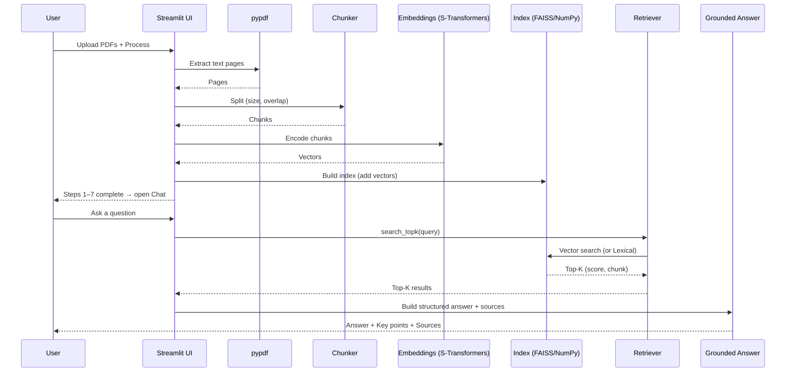
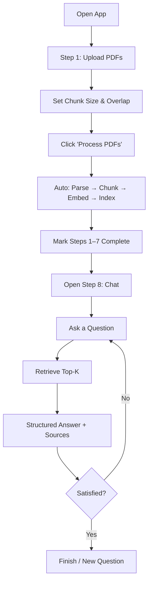

# DocuBot Studio
Turn your PDFs into a grounded, domain‑agnostic chatbot in minutes.

## What it is
- Upload PDFs → app auto‑parses, chunks, embeds, indexes, and launches chat.
- Answers are grounded in retrieved snippets with citations.
- CPU‑friendly; FAISS for fast search; lexical fallback available.

## Quick start
1. pip install -r requirements.txt
2. streamlit run app_steps_patch.py
3. Upload PDFs → Process PDFs → chat in Step 8.

## Architecture
```mermaid
flowchart LR
  U[End User (Browser)] -->|HTTPS| ST[Streamlit App]

  subgraph ST_RUNTIME[Streamlit Runtime]
    ST --> SS[(Session State)]
    ST --> PARSE[pypdf: Parse PDFs]
    ST --> CHUNK[Chunker: char-size + overlap]
    ST --> EMB[Sentence-Transformers: Embeddings]
    ST --> INDEX[FAISS IndexFlatIP or NumPy]
    ST --> RET[Retriever: Vector or Lexical]
    ST --> GEN[Answer Composer: Grounded Markdown]
    ST --> UI[UI: Steps, Metrics, Chat]
  end

  PARSE --> CHUNK --> EMB --> INDEX
  UI --> RET
  INDEX --> RET
  RET --> GEN
  GEN --> UI
  SS --- UI
```

## Data flow


## User journey


## Tech stack
- Streamlit, Python 3
- pypdf, sentence-transformers, faiss-cpu, numpy
- Character-based chunking with overlap
- Vector retrieval (cosine) + lexical fallback

## Deployment (Streamlit Cloud)
- Repo: deva2008/DocuBot (main)
- App file: app_steps_patch.py
- Requirements: requirements.txt

## Exporting diagrams
- Paste any ```mermaid block into https://mermaid.live → Download as SVG/PNG.

## Roadmap
- OCR fallback for scanned PDFs (pytesseract)
- Clickable citations/side panel
- Hybrid retrieval (BM25 + vector)
- Persisted indexes, evaluation suite
